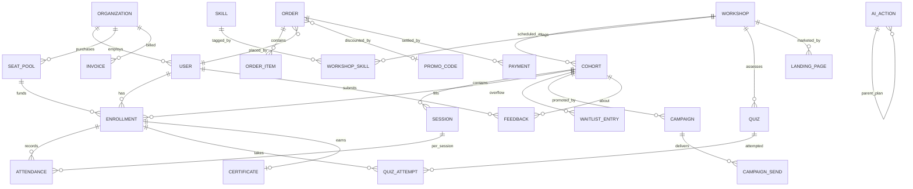

# Workshop OS — Data Model

**Status:** Draft v0.1 · pairs with `PRODUCT_SPEC.md` §3–§7 · GitHub renders the Mermaid diagram below.

Conventions: all IDs are UUIDs; all tables carry `created_at` / `updated_at`; bilingual content fields are JSONB `{ "en": ..., "ja": ... }` and are marked **(i18n)**; money is stored as integer minor units with a `currency` column (`JPY` has no minor units — store yen as-is).

---

## 1. Entity-relationship overview

---

## 2. Identity & tenancy

### `user`
| Column | Type | Notes |
|---|---|---|
| id | uuid PK | |
| email | citext unique | login identifier |
| name | jsonb **(i18n-ish)** | `{ "display": ..., "family": ..., "given": ... }` — supports JA family-name-first rendering |
| role | enum | `owner` \| `staff` \| `org_admin` \| `participant` |
| organization_id | uuid FK nullable | null for individuals; org_admin/participant may belong to one org |
| locale | enum | `en` \| `ja` — drives UI, emails, certificates |
| timezone | text | default `Asia/Tokyo` |
| notification_prefs | jsonb | nudge mute flags |

### `organization`
| Column | Type | Notes |
|---|---|---|
| id | uuid PK | |
| name | jsonb **(i18n)** | legal + display name |
| billing_email | citext | |
| billing_method | enum | `card` \| `invoice_transfer` |
| invoice_registration_no | text nullable | counterpart 適格請求書 number if they provide one |
| locale | enum | default correspondence language |

Row-level security: every org-scoped query filters by `organization_id`; participants see only their own rows.

---

## 3. Workshop domain

### `workshop`
| Column | Type | Notes |
|---|---|---|
| id | uuid PK | |
| slug | text unique | used in URLs |
| title / summary / description / outcomes | jsonb **(i18n)** | |
| level | enum | `intro` \| `intermediate` \| `advanced` |
| status | enum | `draft` \| `published` \| `archived` (booking state lives on cohort) |
| completion_rule | jsonb | `{ attendance_pct: 80, quiz_pass_pct: 70 }` overrides |
| localization_review | jsonb | per-locale `ai_localized` \| `human_reviewed` |

### `cohort`
| Column | Type | Notes |
|---|---|---|
| id | uuid PK, workshop_id FK | |
| status | enum | `open` \| `full` \| `running` \| `completed` \| `cancelled` |
| starts_at / ends_at | timestamptz | |
| capacity | int | |
| price_jpy / price_usd | int nullable | explicit dual pricing (spec §4.1) |
| format | enum | `online` \| `in_person` \| `hybrid` |
| venue | jsonb **(i18n)** nullable | address or platform |
| meeting_url | text nullable | Zoom/Meet |
| facilitator_id | uuid FK user | |

### `session`
| id · cohort_id FK · seq int · starts_at/ends_at · agenda **(i18n)** · materials jsonb[] (refs to `content_item`) · checkin_token text |

### `content_item`
| id · workshop_id FK · kind enum(`slide`,`doc`,`video`,`prework`) · title **(i18n)** · storage_key · locale_variants jsonb |

### `skill` / `workshop_skill`
| `skill`: id · name **(i18n)** · slug — `workshop_skill`: workshop_id · skill_id · weight |

### `waitlist_entry`
| id · cohort_id FK · user_id FK · position int · ai_attend_score numeric nullable · promoted_at · expires_at (24h confirm window) · status enum(`waiting`,`offered`,`confirmed`,`expired`) |

---

## 4. Commerce

### `order`
| Column | Type | Notes |
|---|---|---|
| id | uuid PK | |
| buyer_user_id | uuid FK | |
| organization_id | uuid FK nullable | set for B2B seat purchases |
| kind | enum | `individual_enrollment` \| `seat_pool` |
| status | enum | `pending` \| `awaiting_transfer` \| `paid` \| `refunded` \| `partially_refunded` \| `cancelled` |
| currency | enum | `JPY` \| `USD` |
| subtotal / discount / tax / total | int | tax = 10% consumption tax for JPY |
| promo_code_id | uuid FK nullable | one code max (spec §4.3) |
| utm | jsonb nullable | attribution snapshot at purchase |

### `order_item`
| id · order_id FK · cohort_id FK nullable · seat_pool spec jsonb nullable · qty · unit_price |

### `payment`
| id · order_id FK · provider enum(`airwallex_card`,`airwallex_konbini`,`bank_transfer`) · provider_ref · status · amount · received_at — bank transfers reconciled manually or via webhook; idempotency key on provider_ref |

### `invoice`
| id · organization_id FK · order_id FK · number text (sequential, printed) · qualified_invoice_no text (ours, spec §4.2 ⚠) · pdf_storage_key · due_at · status enum(`issued`,`paid`,`overdue`,`void`) |

### `promo_code`
| id · code unique · type enum(`percent`,`fixed`,`early_bird`,`seat_limited`,`referral`) · value · currency nullable · max_redemptions · redeemed_count · valid_from/until · cohort_scope uuid[] nullable · created_by enum(`human`,`ai_approved`) |

### `seat_pool`
| id · organization_id FK · order_id FK · seats_total · seats_used · valid_until · status |

### `refund`
| id · payment_id FK · amount · reason · approved_by uuid FK user · ai_action_id FK nullable — ties into autonomy tiers (spec §7) |

---

## 5. Learning & progress

### `enrollment`
| Column | Type | Notes |
|---|---|---|
| id | uuid PK | |
| user_id / cohort_id | FK, unique together | |
| source | enum | `self_paid` \| `org_seat` \| `comp` |
| seat_pool_id | uuid FK nullable | consumes one seat when set |
| status | enum | `active` \| `completed` \| `dropped` \| `refunded` |
| completed_at | timestamptz nullable | set when completion rule satisfied |

### `attendance`
| id · enrollment_id FK · session_id FK · status enum(`present`,`absent`,`excused`) · method enum(`facilitator`,`self_checkin`,`auto_join`) · recorded_at |

### `quiz` / `quiz_question` / `quiz_attempt`
- `quiz`: id · workshop_id FK · title **(i18n)** · pass_pct · status enum(`ai_draft`,`published`) — AI-generated, staff-reviewed before publish.
- `quiz_question`: id · quiz_id FK · seq · prompt **(i18n)** · options jsonb **(i18n)** · correct_key · explanation **(i18n)**
- `quiz_attempt`: id · enrollment_id FK · quiz_id FK · answers jsonb · score_pct · passed bool · attempted_at

### `certificate`
| id · enrollment_id FK unique · verify_code text unique (public verification URL) · issued_at · pdf_storage_key_en / pdf_storage_key_ja |

### `progress_event` (append-only)
| id · enrollment_id FK · kind enum(`prework_done`,`session_attended`,`quiz_passed`,`nudge_sent`,`completed`) · payload jsonb · at — feeds the skill graph, predictive ops, and narrative analytics without overloading core tables |

### `feedback`
| id · cohort_id FK · user_id FK nullable (anonymous allowed) · ratings jsonb · text_body text · language enum · ai_theme text nullable · ai_sentiment numeric nullable |

---

## 6. Marketing

### `landing_page`
| id · workshop_id FK · locale · variant char(1) · content jsonb (structured blocks) · status enum(`ai_draft`,`approved`,`live`,`retired`) · traffic_weight numeric — A/B reallocation updates weight |

### `campaign` / `campaign_send`
- `campaign`: id · cohort_id FK · kind enum(`announce`,`reminder`,`last_seats`) · sequence jsonb **(i18n)** · status enum(`draft`,`approved`,`running`,`done`)
- `campaign_send`: id · campaign_id FK · user/email · locale · sent_at · opened_at · clicked_at

### `attribution_visit`
| id · session_key · utm jsonb · referrer · landing_page_id FK nullable · at — joined to `order.utm` for funnel reporting |

---

## 7. AI operating layer

### `ai_action` (the Ledger — append-only, never deleted)
| Column | Type | Notes |
|---|---|---|
| id | uuid PK | |
| parent_id | uuid FK nullable | multi-step plans: children reference the plan action |
| initiated_by | uuid FK user nullable | null = system-scheduled |
| surface | enum | `copilot` \| `concierge` \| `scheduler` |
| tool_name | text | matches `COPILOT_TOOLS.md` |
| tier | enum | `auto` \| `approve` \| `owner_only` |
| input / output | jsonb | full call record |
| status | enum | `proposed` \| `approved` \| `executed` \| `rejected` \| `rolled_back` \| `failed` |
| approved_by | uuid FK nullable | |
| reversal_of | uuid FK nullable | rollback linkage |

### `embedding`
| id · entity_type · entity_id · locale · vector vector(1536) · text_hash — pgvector index; covers workshops, feedback, participants' skill summaries for semantic search |

---

## 8. Indexes & constraints worth stating now

- `enrollment (user_id, cohort_id)` unique — no double enrollment.
- `payment.provider_ref` unique — webhook idempotency.
- Partial index on `cohort (status) WHERE status IN ('open','full')` — catalog queries.
- `seat_pool.seats_used <= seats_total` check constraint.
- `promo_code.redeemed_count <= max_redemptions` enforced in transaction, not just app code.
- All **(i18n)** jsonb fields validated by app-level schema: both locales required before `status` can leave draft/AI-draft states.
